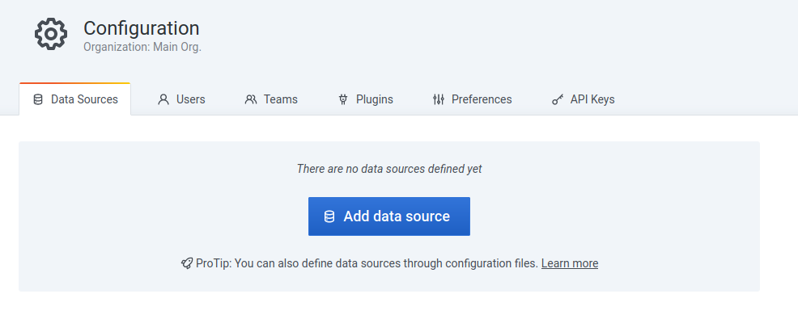
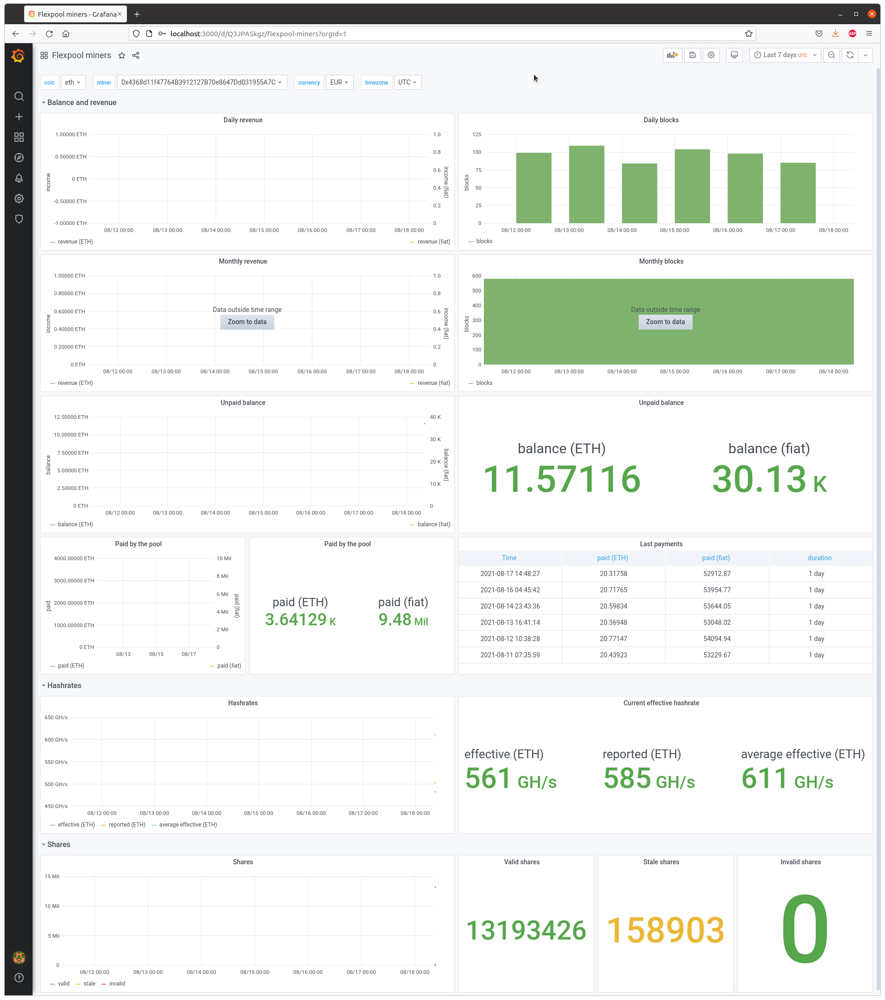

# Mining dashboards

Grafana dashboards for cryptocurrency miners.

## Requirements

Dashboards rely on the following softwares:
 - [Telegraf](https://github.com/influxdata/telegraf) to gather metrics (input) and write to a datastore (output)
 - [InfluxDB](https://github.com/influxdata/influxdb) to store metrics on the long-term
 - [Grafana](https://github.com/grafana/grafana) to visualize metrics

This stack is also known as the **TIG** stack.

## Quickstart

### Create infrastructure

**Testing purpose only**.

This guide uses [Docker](https://www.docker.com/). Ensure you have `docker`, `docker-compose` and `openssl` binaries
installed.

Write grafana and influxdb credentials:

```
cp -p docker/environment.example docker/environment
vi docker/environment
```

Depending on inputs, you should also set the miner address and HiveOS token.

Generate a self-signed certificate:

```
openssl req -x509 -nodes -newkey rsa:2048 -keyout docker/ssl/my.key -out docker/ssl/my.crt -days 365
```

Press enter to every question.

Then start containers:

```
docker-compose up -d
```

See logs with:

```
docker-compose logs -f
```

## Configure Telegraf

Telegraf inputs configurations are stored in [telegraf](telegraf) directory. You can test them using the following
command:

```
docker run --rm -e "MINER_ADDRESS=${MINER_ADDRESS}" \
    -v "${PWD}/docker/telegraf.conf:/etc/telegraf/telegraf.conf:ro" -v "${PWD}/telegraf:/etc/telegraf/telegraf.d:ro" \
    telegraf:1.18.2 telegraf -test -config /etc/telegraf/telegraf.conf -config-directory /etc/telegraf/telegraf.d
```

Example:

```
2021-02-02T14:39:57Z I! Starting Telegraf 1.15.4
> currencies,from=ETH,host=docker,to=EUR value=1171.49 1612276798000000000
> currencies,from=ETH,host=docker,to=USD value=1411.03 1612276798000000000
> flexpool_balance,host=docker,miner=0x3e2251567f87E4B6a3927158AF9c678ECa87a337 result=69375170480923064 1612276798000000000
> flexpool_workers,host=docker,miner=0x3e2251567f87E4B6a3927158AF9c678ECa87a337,name=rig1 effective_hashrate=86666666,invalid_shares=0,reported_hashrate=96304517,stale_shares=3,valid_shares=2008 1612276798000000000
> flexpool_daily_revenue_estimation,host=docker,miner=0x3e2251567f87E4B6a3927158AF9c678ECa87a337 result=6710141993155250 1612276798000000000
> flexpool_paid,host=docker,miner=0x3e2251567f87E4B6a3927158AF9c678ECa87a337 result=0 1612276798000000000
> flexpool_stats,host=docker,miner=0x3e2251567f87E4B6a3927158AF9c678ECa87a337 current_effective_hashrate=86666666,current_reported_hashrate=96304517,daily_effective_hashrate=92962962.625,daily_invalid_shares=0,daily_reported_hashrate=96286435.27777778,daily_stale_shares=3,daily_valid_shares=2008 1612276798000000000
```

Once you are confident with your configuration, reload the container:

```
docker-compose restart telegraf
```

## Configure Grafana

### Login

Go to [Grafana URL](http://localhost:3000/). Login with credentials set in the "*Create infrastructure*" section.


### Add a datasource

Go to *Configuration*, *Data Sources*:


Select on *Add data source*:



Search for *InfluxDB*:


Then add read-only credentials to access the InfluxDB data store:
- **Name**: `InfluxDB`
- **URL**: `https://influxdb:8086`
- **Basic auth**: enabled
- **Skip TLS Verify**: enabled
- **User**: defined by `INFLUXDB_READ_USER`
- **Password**: defined by `INFLUXDB_READ_USER_PASSWORD`
- **Min time interval**: `60s` (Telegraf interval)


Click on *Save & Test*:


### Import dashboard

Click on *Import*:


Then upload JSON file from this repository:


Select *InfluxDB* data source and click on *Import*:


Your dashboard should be imported!



Repeat the operation for other dashboards if needed.

## Remove infrastructure

Use docker-compose to remove containers and their volumes:

```
docker-compose down -v
```

## Disclaimer

Telegraf is able to make API call on thrid-party services. Please read terms of service before going further. The
repository owner cannot be responsible of any abuse.
