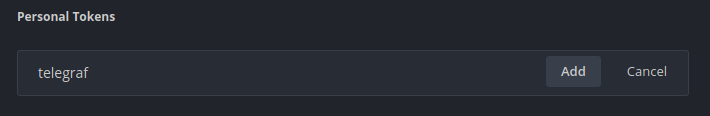
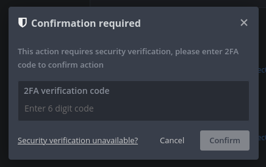
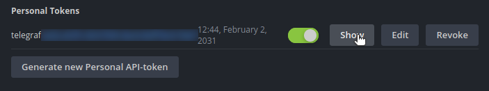

# Telegraf inputs

Ensure to replace `MINER_ADDRESS` with your Ethereum wallet address.

## HiveOS API

### Create token

On your [account](https://the.hiveos.farm/account) page, go to *Authentication Tokens*, search for *Personal Tokens* and
create one for `telegraf`:



Enter your 2FA code if needed:



Clic on *Show*:



And add this value to the `HIVEOS_TOKEN` environment variable (see *Quickstart* section in the [README](../README.md)).

### Create Telegraf configuration

```
cd hiveos
sudo apt install python3-virtualenv
virtualenv venv
source venv/bin/activate
pip install -r requirements.txt
read -s HIVEOS_TOKEN
export HIVEOS_TOKEN
python3 generate.py --verbose
unset HIVEOS_TOKEN
mv hiveos.conf ../
```
